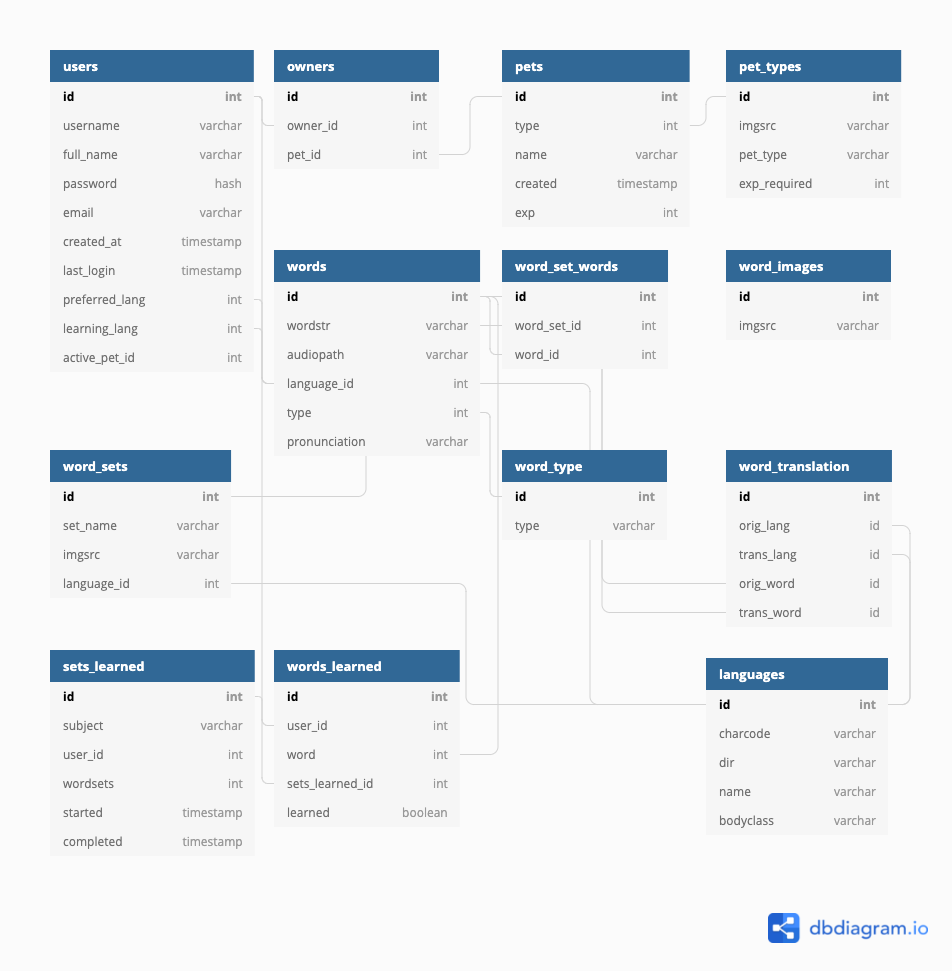

# Distant Life

## 🍿 Video Demo

https://youtu.be/zrIuFmyARn8

<br/>


## 🤖 Description

Raise virtual pets while improving your language skills! You've landed on a new planet and need to learn words and phrases in order to grow your family of pets and travel to new worlds. Certain pets can only be adopted with enough experience, and quizzes for certain words and phrases can only be unlocked once you've adopted the pets that live on the corresponding planet. 

In addition to growing your pets, you'll be able to review words and test your knowledge with short quizzes. Gain experience as you answer quiz questions correctly. 

Future enhancements include:

- Generate vocabulary automatically from quest stories (admin tool)
- Duplicate vocabulary detection and merge workflow
- Vocabulary review and approval workflow with draft state
- Tracking which words are learned
- Notifications
- Badges earned
- Stores and inventory where a user can practice purchasing and using items in their targeted learning language
- Customized pets (colors)
- Customizable avatars
- Location backgrounds for different areas
- Setup local environment to support compiling css based on [custom scss](https://github.com/virtual/fed-projects/tree/main/source/_assets/sass/04)
- Autogenerate flash cards and quizzes based on the vocabulary in each set

#### Building the SCSS

This project ships the compiled CSS in `static/` and the SCSS sources live in `source/sass/`.

You can use Dart Sass to compile the SCSS into the existing files consumed by the Flask templates:

```bash
# install dev dependency (one-time)
npm install

# build CSS once
npm run build:css

# build production CSS (minified, no source map)
npm run build:css:prod

# or run a watcher in development
npm run watch:css
```

The npm scripts compile:

- `source/sass/styles.scss` -> `static/styles.css` 


### 📔 Administration

The admin dashboard (available at `/admin/` for users with admin role) provides comprehensive vocabulary and set management using the canonical lemma-based schema:

#### Admin Vocabulary Management

At `/admin/vocabulary/`, admins can:

- **Search & Filter**: Find vocabulary by lemma value with pagination (20/50/100 rows per page)
- **Create**: Add new vocabulary entries with language, part-of-speech, optional image path
- **Edit**: Modify existing primary form, vocalization, definition, Part of Speech (POS), and image paths
- **Bulk Actions**: Select multiple vocabulary items and publish or archive in batch
- **View Usage**: See how many word sets each vocabulary item appears in

#### Upload Vocabulary CSV

At `/admin/upload/`, admins can bulk-import vocabulary into word sets using CSV files. 

The uploader expects at least 5 columns in this exact order:

1. First language name (must match an entry in `languages.name`)
2. First language pronunciation
3. Second language name (must match an entry in `languages.name`)
4. Second language pronunciation
5. `word_type` (must match an entry in `word_type.type`, for example `noun`)

The first row must be headers. Header text is used to detect each column.

Required pattern:

```csv
<Language1>,<Language1Pronunciation>,<Language2>,<Language2Pronunciation>,word_type
```

How column direction works in the admin UI:

- The selected set gets the second language column.
- If you choose "Add first column to additional set", the first language column is added to that additional set.

Example: Upload to a Hebrew set (Translated language) with native language English:

```csv
English,en_pronunciation,עברית,he_pronunciation,word_type
dog,dawg,כלב,kelev,noun
cat,kat,חתול,chatul,noun
```

Optional extra columns are currently ignored by the importer, so you can include reference-only columns (for example a nikkud variant) without breaking upload.

#### Part of Speech (POS) Management

- Noun (שֵׁם עֶצֶם): A person, place, thing, or idea.
- Verb (פֹּעַל): An action or state of being.
- Adjective (שֵׁם תֹּאַר): A word that describes or modifies a noun.
- Adverb (תֹּאַר הַפֹּעַל): A word that modifies a verb, adjective, or another adverb (often ending in "-ly" in English).
- Pronoun (כִּנּוּי גּוּף): A word used in place of a noun (e.g., I, she, they).
- Preposition (מִילַת יַחַס): Describes the relationship between a noun and another part of the sentence (e.g., in, on, at, from).

### 🪐 Localization and Internationalization

To better support users, the site supports language translation and internationalization. For languages that require a right-to-left (RTL) reading direction, the interface mirrors the normal reading direction. In addition, RTL includes small enhancements such as flipping the active pet image and general site layout.

From their profile, a member can switch between their native language and their targeted learning language. Currently, Distant Life only supports English and Hebrew but has been developed to dynamically support more languages.

Word sets and quizzes are supported using a translation table in the SQLite database. Alternatively, front-end words (text keys) such as "Log in", "Complete", "Profile", etc are defined and translated using Babel translations. 

------

## File overview

The site is setup using Python, Flask with Jinja templates, and a custom CSS stylesheet.

Python files

- **application.py** - Contains routes and connection information for Redis (used for session storage) and the SQLite database connection (used for saving data.)
- **fileparser.py** - Processes the uploaded CSV used by admin to add words to word sets dynamically. Files are temporarily stored in `static/files` and then deleted after being processed to save space on the server.
- **helpers.py** - Contains reusable functions and decorators that are used within the application
- **wsgi.py** - Used for automatically running the virtual environment on an nginx server

Template files

- General Layout:
  - **global** - A directory of global includes for the header, footer, and sidebar. These items were refactored into global includes due to the multiple layouts necessary for logged-in versus the anonymous full-page view. Using the global includes allows for easier maintenance.
  - **layout-1col.html** - The general page layout with a sidebar.
  - **layout.html** - The general page layout but full-width.
  - **macros.html** - Contains reusable components for the Jinja templates: experience bar.
- User pages:
  - **about.html** - Displays information generally about the site and credits.
  - **adopt.html** - Allows a user to adopt a pet.
  - **apology.html** - The error page shows the error code and related message.
  - **dashboard.html** - The default landing page after logging in. Shows recent notifications and news items.
  - **index.html** - The front page (anonymous) for visiting users.
  - **list.html** - The list of a user's pets; also contains a link to adopt more.
  - **profile.html** - The user's profile settings for native language, target learning language, account information, and password reset.
  - **quizset.html** - The quiz module for testing ability to identify words and phrases.
  - **train.html** - The list of available word sets that a user can learn and test on.
  - **trainset.html** - The learning module for a word set.
- Sign up and login pages:
  - **login.html** - Allows a user to log in.
  - **signup.html** - Allows a new user to sign up.
- Admin pages (under `/admin/`):
  - **admin/index.html** - Admin dashboard with summaries of vocabulary, senses, and sets.
  - **admin/vocabulary.html** - List vocabulary with search, pagination, bulk action controls.
  - **admin/vocabulary_create.html** - Form to create new vocabulary items.
  - **admin/vocabulary_edit.html** - Form to edit vocabulary values, POS, and optional image paths.
  - **admin/upload.html** - CSV upload form for bulk-importing vocabulary into word sets.

Other files:

- **babel.cfg** - Sets up which files to scan for translation text keys.
- **messages.pot** - The full list of words that will be converted into translation keys (in the `translations/en/LC_MESSAGES` and `translations/he/LC_MESSAGES` folders.)

------

## Data structure



### Database Schema

The lexical data structure was migrated from a simple word/translation model to a **lemma-based linguistic model** (see `migrations/001_big_bang_lemma_cutover.sql`). This supports richer linguistic relationships and better supports different word forms across languages.

#### Core Tables

- **lemma** - The base form of a word. Contains:
  - `language_id`: Language of the lemma
  - `pos_id`: Part-of-speech (noun, verb, etc.)
  - `pronunciation`: Pronunciation guide
  - `audiopath`: Path to audio file (if available)
  - `image_path`: Optional path to vocabulary image
  - `state`: Publication state (published/archived) - optional schema extension
  - `archived_at`: Timestamp when archived - optional schema extension
  
  Each lemma has multiple forms.
  
- **lemma_form** - Surface forms and variants of a lemma in a specific language. Stores:
  - `value`: The actual word text
  - `form_type`: Typically 'surface' for main forms
  - `script`: Writing system (e.g., 'Hebr' for Hebrew, 'Latn' for Latin)
  - `search_key`: Lowercase normalized form for searching
  - `is_primary`: Flag to identify the main form for a language

- **sense** - A meaning or definition of a lemma. One lemma can have multiple senses. Contains:
  - `gloss`: Definition text
  - `part_of_speech`: Part-of-speech category
  - `is_primary`: Flag for the primary sense

- **sense_translation** - Maps senses between languages. Enables translation relationships such as:
  - Exact translations
  - Broader/narrower meanings
  - Related concepts

- **set_item** - Links senses to word sets for learning modules.

#### Other Tables

- **users** - User accounts with preferred language and learning language preferences
- **pets** / **pet_types** - Pet ownership and pet definitions
- **word_sets** - Collections of words for learning
- **word_type** - Parts of speech (noun, verb, etc.)
- **languages** - Available languages with character codes, text direction, and CSS classes
- **sets_learned** / **words_learned** - User progress tracking

#### Translation Workflow

To find a translation for a vocabulary word:

1. Find the `lemma_form` matching the word in the learning language
2. Get the `sense` for that lemma
3. Find the translated `sense` via `sense_translation`
4. Retrieve the primary `lemma_form` for the translated sense in the preferred language

This is implemented in `quest_content.py`'s `get_vocabulary_with_translations()` function.

#### Quest Vocabulary Integration

Quest episodes reference vocabulary by **lemma ID** in their `vocabulary_target_ids` array. When rendering a quest episode:

1. Lemma IDs are validated against the canonical `lemma` table
2. The translation workflow above retrieves word + translation pairs
3. Vocabulary table is rendered directly from database results in the quest episode template

This ensures all vocabulary shown in quests is live from your word database—changes to vocabulary in the admin UI are immediately reflected in quest stories.

------

## Development

### Linux

```sh
brew install redis
```

Enable virtual environment:

```sh
python3 -m venv venv
. venv/bin/activate
python -m pip install --upgrade pip
python -m pip install -r requirements.txt
export FLASK_APP=application
export FLASK_ENV=development # enable autoreload
```

Use `requirements.txt` for local development. Production server packages are in `requirements-prod.txt`.

### Windows (Bash)

Install [Memurai](https://docs.memurai.com/en/windows-service) (Redis-compatible) and start the service:

```sh
memurai.exe --service-start
```

Enable virtual environment:

```sh
bash scripts/dev.sh
```

For Linux deployment environments, install production packages with:

```sh
python -m pip install -r requirements-prod.txt
```

## Running

Linux:

```sh
redis-server # terminal #1
flask run # terminal #2 (venv)
```

Windows:

```sh
memurai.exe --service-start # run once to ensure service is started
bash scripts/dev.sh
```

## Testing

Run the test suite:

```sh
bash scripts/test.sh
```

Tests are located in the `tests/` directory and use Python's unittest framework.

## Translations

Get translation keys:

```python
pybabel extract -F babel.cfg -o messages.pot --input-dirs=.
# pybabel init -i messages.pot -d translations -l en # for init only
# pybabel init -i messages.pot -d translations -l he
pybabel update -i messages.pot -d translations -l en
pybabel update -i messages.pot -d translations -l he
```

After translating keys in translations folder compile .mo files:

```python
pybabel compile -d translations
```

Usage in templates with `_('Word')` or `gettext('Word')`:

```html
<h2>{{ _('Free Trial') }}</h2>
<input type="submit" value="{{ gettext('Sign up') }}"/>
```


Visit http://127.0.0.1:5000/

## Resources 

- [Front-end styling and development](https://virtual.github.io/fed-projects/04) | [GitHub Repo](https://github.com/virtual/fed-projects)
- [Figma design](https://www.figma.com/file/6ckmGH0eDFj1956hPH8n0V/DistantLife-final-CS50x?node-id=6%3A2860)
