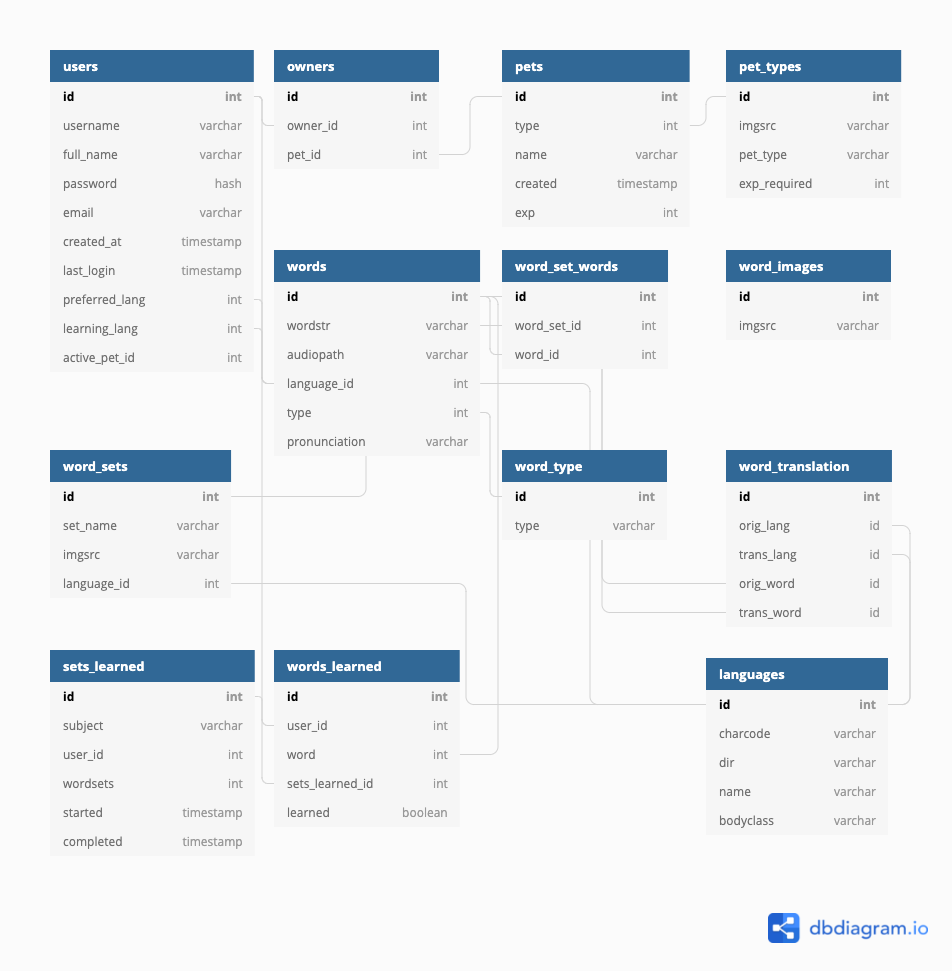

# Distant Life

## 🍿 Video Demo

https://youtu.be/zrIuFmyARn8

<br/>


## 🤖 Description

Raise virtual pets while improving your language skills! You've landed on a new planet and need to learn words and phrases in order to grow your family of pets and travel to new worlds. Certain pets can only be adopted with enough experience, and quizzes for certain words and phrases can only be unlocked once you've adopted the pets that live on the corresponding planet. 

In addition to growing your pets, you'll be able to review words and test your knowledge with short quizzes. Gain experience as you answer quiz questions correctly. 

Future enhancements include:

- Tracking which words are learned
- Notifications
- Badges earned
- Stores and inventory where a user can practice purchasing and using items in their targeted learning language
- Customized pets (colors)
- Customizable avatars
- Location backgrounds for different areas

### 📔 Administration

In addition to the member experience, there is an admin dashboard available to users with an admin role. In this area, an admin can:

- Create new word sets
- Add new words to word sets using a CSV file uploader
- Delete words from word sets

### 🪐 Localization and Internationalization

To better support users, the site supports language translation and internationalization. For languages that require a right-to-left (RTL) reading direction, the interface mirrors the normal reading direction. In addition, RTL includes small enhancements such as flipping the active pet image and general site layout.

From their profile, a member can switch between their native language and their targeted learning language. Currently, Distant Life only supports English and Hebrew but has been developed to dynamically support more languages.

Word sets and quizzes are supported using a translation table in the SQLite database. Alternatively, front-end words (text keys) such as "Log in", "Complete", "Profile", etc are defined and translated using Babel translations. 

------

## File overview

The site is setup using Python, Flask with Jinja templates, and a custom CSS stylesheet.

Python files

- **application.py** - Contains routes and connection information for Redis (used for session storage) and the SQLite database connection (used for saving data.)
- **fileparser.py** - Processes the uploaded CSV used by admin to add words to word sets dynamically. Files are temporarily stored in `static/files` and then deleted after being processed to save space on the server.
- **helpers.py** - Contains reusable functions and decorators that are used within the application
- **wsgi.py** - Used for automatically running the virtual environment on an nginx server

Template files

- General Layout:
  - **global** - A directory of global includes for the header, footer, and sidebar. These items were refactored into global includes due to the multiple layouts necessary for logged-in versus the anonymous full-page view. Using the global includes allows for easier maintenance.
  - **layout-1col.html** - The general page layout with a sidebar.
  - **layout.html** - The general page layout but full-width.
  - **macros.html** - Contains reusable components for the Jinja templates: experience bar.
- User pages:
  - **about.html** - Displays information generally about the site and credits.
  - **adopt.html** - Allows a user to adopt a pet.
  - **apology.html** - The error page shows the error code and related message.
  - **dashboard.html** - The default landing page after logging in. Shows recent notifications and news items.
  - **index.html** - The front page (anonymous) for visiting users.
  - **list.html** - The list of a user's pets; also contains a link to adopt more.
  - **profile.html** - The user's profile settings for native language, target learning language, account information, and password reset.
  - **quizset.html** - The quiz module for testing ability to identify words and phrases.
  - **train.html** - The list of available word sets that a user can learn and test on.
  - **trainset.html** - The learning module for a word set.
- Sign up and login pages:
  - **login.html** - Allows a user to log in.
  - **signup.html** - Allows a new user to sign up.
- Admin pages:
  - **createset.html** - Allows an admin to create a new word set.
  - **editsets.html** - Shows all available word sets.
  - **editset.html** - Allows an admin to edit a set by deleting existing words or uploading a CSV to add a group of new words to it (and optionally the translated-language word set equivalent.)

Other files:

- **babel.cfg** - Sets up which files to scan for translation text keys.
- **messages.pot** - The full list of words that will be converted into translation keys (in the `translations/en/LC_MESSAGES` and `translations/he/LC_MESSAGES` folders.)

------

## Data structure



Tables were created to allow for users to own multiple pets, translate words, create word sets and quizzes, and more.

------

## Development

```sh
brew install redis
```

Enable virtual environment:

```sh
python3 -m venv venv
. venv/bin/activate
pip install -r requirements.txt
export FLASK_APP=application
export FLASK_ENV=development # enable autoreload
```

## Running

```sh
redis-server # terminal #1
flask run # terminal #2 (venv)
```

## Translations

Get translation keys:

```python
pybabel extract -F babel.cfg -o messages.pot --input-dirs=.
# pybabel init -i messages.pot -d translations -l en # for init only
# pybabel init -i messages.pot -d translations -l he
pybabel update -i messages.pot -d translations -l en
pybabel update -i messages.pot -d translations -l he
```

After translating keys in translations folder compile .mo files:

```python
pybabel compile -d translations
```

Usage in templates with `_('Word')` or `gettext('Word')`:

```html
<h2>{{ _('Free Trial') }}</h2>
<input type="submit" value="{{ gettext('Sign up') }}"/>
```


Visit http://127.0.0.1:5000/

## Resources 

- [Front-end styling and development](https://virtual.github.io/fed-projects/04) | [GitHub Repo](https://github.com/virtual/fed-projects)
- [Figma design](https://www.figma.com/file/6ckmGH0eDFj1956hPH8n0V/DistantLife-final-CS50x?node-id=6%3A2860)
